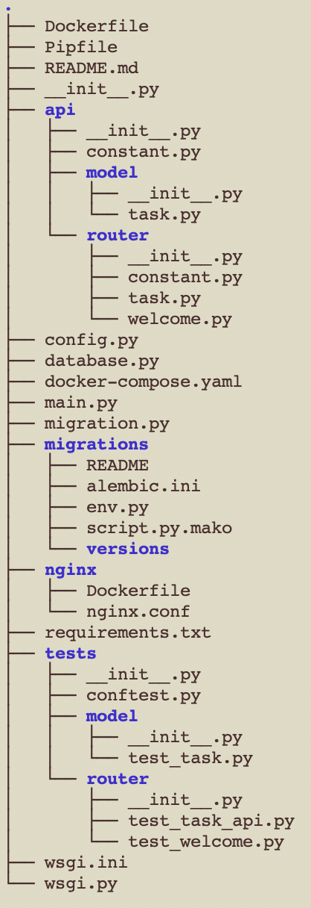

# flask-api

## Task Management REST API

This is a back-end code repository.

This is a full featured Task Management REST API back-end built with flask and MySQL.

Features include:

- Full CRUD features for Task instances.
- Swagger API docs online

## SETUP INSTRUCTIONS

To use this code, you'll need a Python environment or Docker-compose environment.

We strongly recommend using docker-compose for this project

```bash
git git@github.com:tainenko/flask-api.git
cd flask-api
docker-compose build && docker-compose up
```

## Project Structure



## Runtime Environment Requirement

- Python 3.7
- Flask 1.1
- uWSGI LTS
- MySQL 8.0.23 (Docker Image: mysql/mysql-server:8.0.23)
- nginx 1.19.5
- Ubuntu 18.04
- Docker
- flasgger

## API Spec

- Spec
    - Fields of task:
        - name
            - Type: String
        - status
            - Type: Bool
            - Value
                - 0=Incomplete
                - 1=Complete
    - Reponse headers
        - Content-Type=application/json

### 1. GET /tasks (list tasks)

```
{
    "result": [
        {"id": 1, "name": "name", "status": 0}
    ]
}
```

### 2. POST /task  (create task)

```
request
{
  "name": "買晚餐"
}

response status code 201
{
    "result": {"name": "買晚餐", "status": 0, "id": 1}
}
```

### 3. PUT /task/<id> (update task)

```
request
{
  "name": "買早餐",
  "status": 1
  "id": 1
}

response status code 200
{
  "name": "買早餐",
  "status": 1,
  "id": 1
}
```

### 4. DELETE /task/<id> (delete task)

response status code 200
